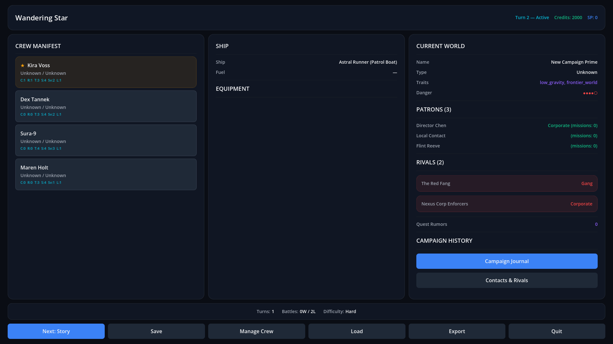
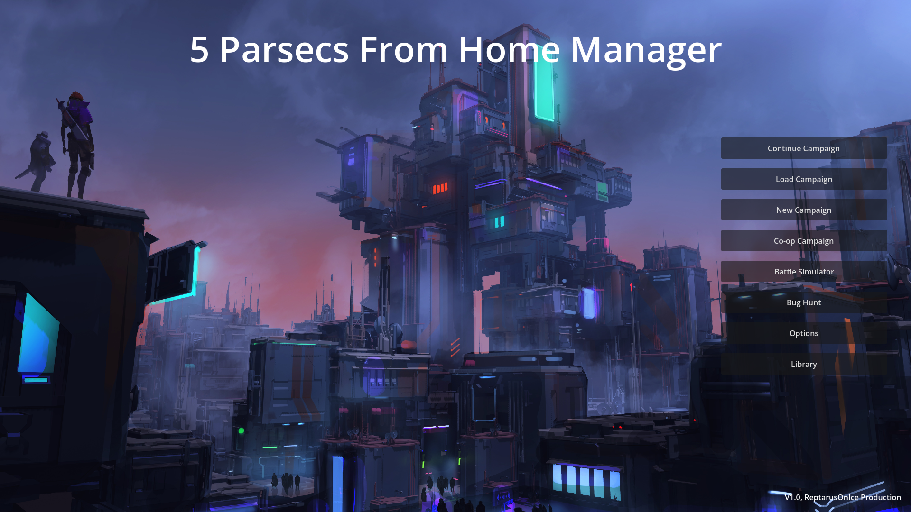
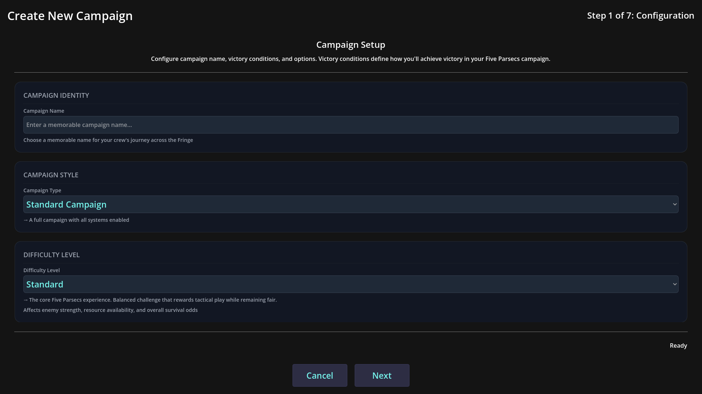
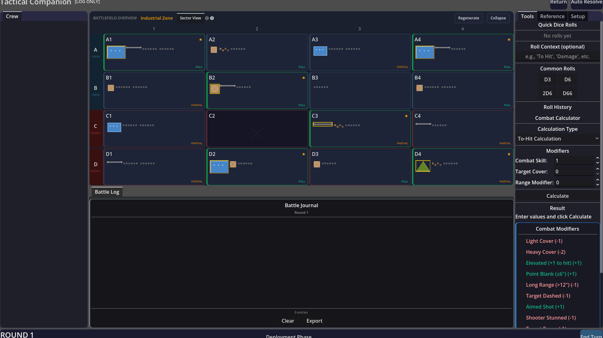
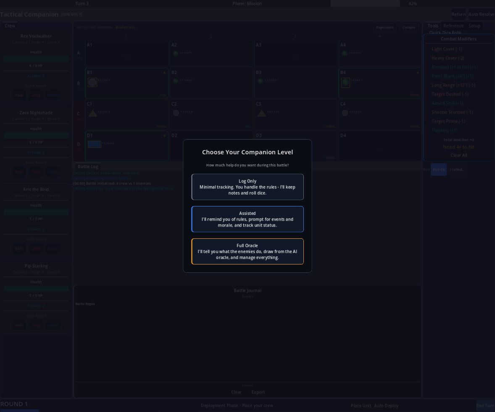
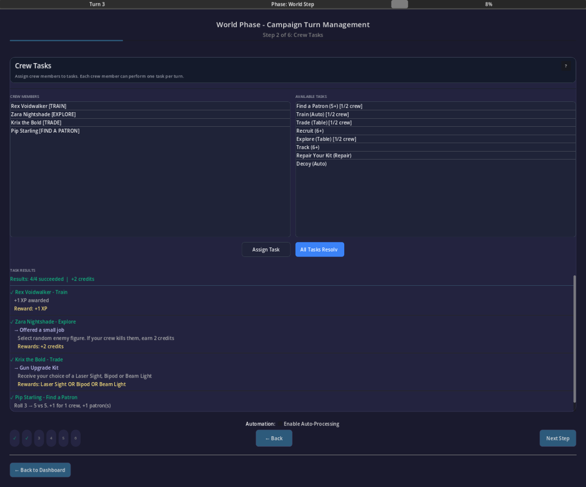
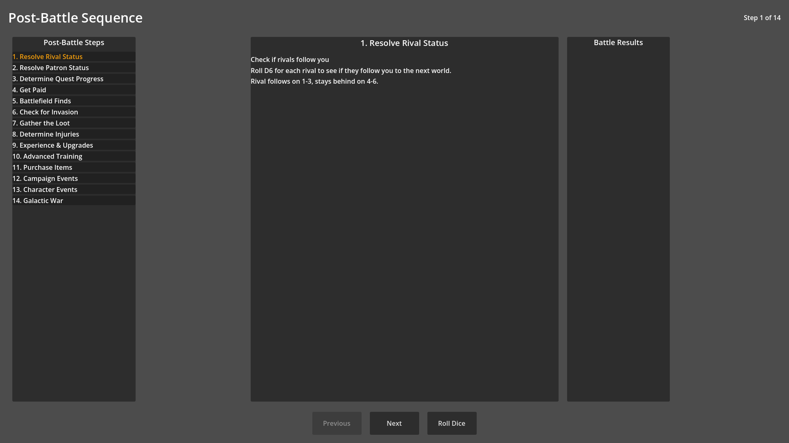

# Five Parsecs Campaign Manager

> A digital campaign companion for [**Five Parsecs From Home**](https://modiphius.net/en-us/collections/five-parsecs-from-home) — handles the bookkeeping, dice rolling, table lookups, and campaign tracking so you can focus on actually playing.

[](https://godotengine.org/)
[](LICENSE)


[](https://github.com/Reptarus/five-parsecs-campaign-manager/stargazers)
[](https://github.com/Reptarus/five-parsecs-campaign-manager/network/members)

[](https://github.com/Reptarus/five-parsecs-campaign-manager/issues)
[](https://github.com/Reptarus/five-parsecs-campaign-manager/commits/master)
<!-- Uncomment and replace URLs when support pages are live:
[](https://ko-fi.com/YOUR_PAGE)
[](https://patreon.com/YOUR_PAGE)
-->

Developed with the awareness and blessing of [Modiphius Entertainment](https://modiphius.net/). 170 out of 170 game mechanics implemented — **100% core rules coverage** including all Compendium content.

---



---

## Screenshots

<table>
  <tr>
    <td align="center"><br/><b>Main Menu</b></td>
    <td align="center"><br/><b>Campaign Creation</b><br/>Step 1 config with difficulty settings</td>
  </tr>
  <tr>
    <td align="center"><br/><b>Battle Companion</b><br/>4x4 grid, combat tools, dice dashboard</td>
    <td align="center"><br/><b>Companion Levels</b><br/>Log Only, Assisted, or Full Oracle</td>
  </tr>
  <tr>
    <td align="center"><br/><b>World Phase</b><br/>Crew task assignment and results</td>
    <td align="center"><br/><b>Post-Battle Sequence</b><br/>14-step processing with injury, loot, XP</td>
  </tr>
</table>

---

## Features

### Campaign Lifecycle
- **7-phase creation wizard**: Config, Captain, Crew, Equipment, Ship, World, Review
- **Complete 9-phase turn loop**: Story, Travel, Upkeep, Mission, Post-Battle, Advancement, Trading, Character, Retirement
- Save/load with auto-save and rotating backups

### Battle Companion
A **tabletop assistant** that generates text instructions for your physical tabletop. Three tracking tiers:

| Tier | You Handle | App Handles |
| ---- | ---------- | ----------- |
| **Log Only** | Everything | Records results |
| **Assisted** | Confirmation | Suggests rolls and outcomes |
| **Full Oracle** | Nothing | All mechanics (great for solo) |

Includes: dice dashboard, combat calculator, situation analyzer, activation tracker, weapon reference, terrain setup guide, enemy intent suggestions, deployment zone calculator, and victory condition tracker.

### Visual Battlefield
4x4 sector grid (A1-D4) with procedural terrain from 8+ themes — Industrial Zone, Wilderness, Alien Ruin, Crash Site, Urban Settlement, Wasteland, Ship Interior, and more. Click any cell for descriptions and gameplay effects.

### Post-Battle Processing
All 14 sub-steps automated: injury tables (human + bot), loot with implant auto-install, XP distribution, Stars of Story, morale, equipment damage/repair, recovery, and journal entries.

### Crew Management
Full character system: combat, reaction, toughness, speed, savvy, luck. Skills, abilities, XP/leveling, equipment loadouts with comparison tool, implant system (6 types, max 3), morale, faction relations, and character history.

### World Phase
Crew tasks (trade, explore, recruit, train) with D100 result tables matching Core Rules pp. 76-82. Patron jobs, faction missions, per-planet tracking, and world economy modifiers.

### Compendium Support (3 Optional Packs)
All Compendium content separated as optional modules — zero impact when disabled:

- **Trailblazer's Toolkit** — Krag & Skulker species, psionics, bot upgrades, psionic gear
- **Freelancer's Handbook** — Progressive difficulty, AI variations, elite enemies, expanded missions
- **Fixer's Guidebook** — Stealth missions, street fights, salvage jobs, expanded factions

### Bug Hunt Gamemode
Standalone military-themed variant with its own 3-stage turn loop, creation wizard, dashboard, and character transfer between campaign modes.

### Store & DLC System
Tri-platform purchase system (Steam, Android, iOS) with offline fallback. Compendium content gated behind DLC flags.

---

## Getting Started

### Prerequisites

- [Godot 4.6-stable](https://godotengine.org/download) (standard build — **not** the .NET/mono version)

### Installation

```bash
git clone https://github.com/Reptarus/five-parsecs-campaign-manager.git
```

1. Open Godot 4.6
2. Click **Import** and navigate to the cloned folder
3. Select `project.godot` and open the project
4. Press **F5** to run

### Current Status

**Demo-ready.** All core features complete, the full campaign gameplay loop is playable across all 9 phases, and Bug Hunt is fully functional. Zero compile errors, 100% game mechanics coverage. Bug reports and feedback welcome via [Issues](https://github.com/Reptarus/five-parsecs-campaign-manager/issues).

---

## Roadmap

- Better battlefield visualization (more graphic-centric interface)
- UI polish and mobile optimization
- Bug Hunt co-op mode
- [**Five Parsecs: Tactics**](https://modiphius.net/en-us/products/five-parsecs-from-home-tactics) support — multi-squad management, vehicles, larger battlefields
- Community playtesting and public beta (pending Modiphius approval)

---

## Contributing

Contributions are welcome — bug reports, feature requests, and pull requests all appreciated.

- [Report a Bug](https://github.com/Reptarus/five-parsecs-campaign-manager/issues/new?template=bug_report.md)
- [Request a Feature](https://github.com/Reptarus/five-parsecs-campaign-manager/issues/new?template=feature_request.md)

If you find this project useful, consider giving it a **star** — it helps others discover it.

---

<details>
<summary><b>Technical Details</b></summary>

| Detail | Value |
| ------ | ----- |
| Engine | Godot 4.6-stable (pure GDScript) |
| Scripts | ~900 GDScript files |
| Test Framework | gdUnit4 v6.0.3 |
| Mechanics Coverage | 170/170 (100%) |
| Core Rules Systems | 11/11 verified |
| Campaign Phases | 9/9 wired |
| Bug Hunt Gamemode | Complete (38 files, 3-stage turn) |
| Store/DLC System | Tri-platform (Steam/Android/iOS) |

</details>

---

## License

This project is licensed under the MIT License — see the [LICENSE](LICENSE) file for details.

## Acknowledgments

- **[Five Parsecs From Home](https://modiphius.net/en-us/collections/five-parsecs-from-home)** is a tabletop game by [Modiphius Entertainment](https://modiphius.net/). This is a fan-made companion tool, not an official Modiphius product.
- Built with the [Godot Engine](https://godotengine.org/).
