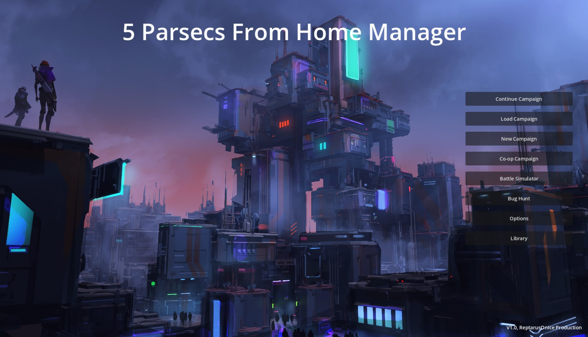

# Five Parsecs Campaign Manager


A digital campaign companion for [**Five Parsecs From Home**](https://modiphius.net/en-us/collections/five-parsecs-from-home) built in Godot 4.6. It handles the bookkeeping, dice rolling, table lookups, and campaign tracking so you can focus on actually playing.

> Developed with the awareness and blessing of [Modiphius Entertainment](https://modiphius.net/).

## Screenshots




---

## Features

### Full Campaign Lifecycle

- **7-phase campaign creation wizard**: Config, Captain, Crew, Equipment, Ship, World, Review
- **Complete 9-phase campaign turn loop**: Story, Travel, Upkeep, Mission, Post-Battle, Advancement, Trading, Character, Retirement
- Save/load with auto-save at each turn start and rotating backups

### 100% Core Rules Coverage

- **170 out of 170** game mechanics implemented, including all Compendium content
- 11 core rules systems verified against the published rulebook
- All dice tables, event charts, injury tables, loot tables, and encounter generators match the rules as written

### Battle Companion

The battle system is a **tabletop companion assistant** — it generates text instructions for you to execute on your physical tabletop. Three tracking tiers depending on how much you want the app to handle:

| Tier | Description |
| ---- | ----------- |
| **Log Only** | You resolve everything, the app records results |
| **Assisted** | App suggests rolls and outcomes, you confirm |
| **Full Oracle** | App resolves all mechanics automatically (great for solo play) |

Tools include: dice dashboard, combat calculator, combat situation analyzer, activation/initiative tracker, round tracker, weapon table reference, cheat sheet, terrain setup guide, enemy intent suggestions, deployment zone calculator, and victory condition tracker.

### Visual Battlefield Grid

4x4 sector grid (A1–D4) generated from terrain themes — Industrial Zone, Wilderness, Alien Ruin, Crash Site, and more. Each cell draws terrain shapes for buildings, rocks, walls, trees, water, hills, containers, and hazards. Click any cell for detailed descriptions and gameplay effects. Regenerate for new layouts.

### Post-Battle Processing

Handles all 14 sub-steps: injury processing (human + bot tables), loot gathering with implant auto-install, experience distribution, Stars of Story persistence, morale updates, equipment damage/repair, recovery ticks, and journal entries.

### Crew Management

Full character system with combat, reaction, toughness, speed, savvy, and luck stats. Skills, abilities, XP/leveling, equipment loadouts with comparison tool, implant system (6 types, max 3), morale tracking, faction relations, and character history with timeline.

### World Phase

- **Crew tasks**: Trade, explore, recruit, train — with proper D100 result tables matching Core Rules pp. 76–82
- **Patron system**: Job generation and completion tracking
- **Faction system**: Rival reputation and faction missions
- **Planet tracking**: Per-planet contacts and data across visits
- **World economy**: Trade modifiers by world type

### Compendium Support (3 Optional Packs)

All Compendium content is separated from core as optional modules with zero impact when disabled:

- **Trailblazer's Toolkit** — Krag & Skulker species, psionics, training, bot upgrades, ship parts, psionic gear
- **Freelancer's Handbook** — Progressive difficulty, AI variations, escalating battles, elite enemies, no-minis combat, grid movement, PvP/co-op, expanded missions/quests/connections
- **Fixer's Guidebook** — Stealth missions, street fights, salvage jobs, expanded factions, world strife, loans, compendium names, introductory campaign, prison planet

### Quality of Life

- Campaign journal with auto-generated entries and character histories
- JSON and Markdown import/export
- Equipment comparison panel
- 21 victory condition types
- Custom dark "Deep Space" UI theme with responsive layout

---

## Getting Started

### Prerequisites

- [Godot 4.6-stable](https://godotengine.org/download) (standard build — **not** the .NET/mono version)

### Installation

```bash
git clone https://github.com/Reptarus/five-parsecs-campaign-manager.git
```

1. Open Godot 4.6
2. Click **Import** and navigate to the cloned folder
3. Select `project.godot` and open the project
4. Press **F5** (or click the Play button) to run

### Current Status

This project is in **pre-beta**. Core features are complete and the full campaign gameplay loop is playable, but expect rough edges. Bug reports and feedback are welcome via [Issues](https://github.com/Reptarus/five-parsecs-campaign-manager/issues).

---

## Roadmap

- Better battlefield visualization (pushing toward a more graphic-centric interface)
- UI polish and mobile optimization
- **Bug Hunt** as a post-1.0 expansion, fully implemented as its own separate manager
- [**Five Parsecs: Tactics**](https://modiphius.net/en-us/products/five-parsecs-from-home-tactics) support — the framework is being built with the goal of eventually handling Tactics as well, with multi-squad management, vehicles, and larger battlefield setups
- Community feedback and playtesting

---

## Contributing

Contributions are welcome! Whether it's bug reports, feature requests, or pull requests — all are appreciated.

- [Report a Bug](https://github.com/Reptarus/five-parsecs-campaign-manager/issues/new?template=bug_report.md)
- [Request a Feature](https://github.com/Reptarus/five-parsecs-campaign-manager/issues/new?template=feature_request.md)

---

## Technical Details

| Detail | Value |
| ------ | ----- |
| Engine | Godot 4.6-stable (pure GDScript) |
| Scripts | ~870 GDScript files |
| Test Framework | gdUnit4 v6.0.3 |
| Mechanics Coverage | 170/170 (100%) |
| Core Rules Systems | 11/11 verified |
| Campaign Phases | 9/9 wired |

---

## License

This project is licensed under the MIT License — see the [LICENSE](LICENSE) file for details.

## Acknowledgments

- **[Five Parsecs From Home](https://modiphius.net/en-us/collections/five-parsecs-from-home)** is a tabletop game by Modiphius Entertainment. This project is a fan-made companion tool and is not an official Modiphius product.
- Built with the [Godot Engine](https://godotengine.org/).
