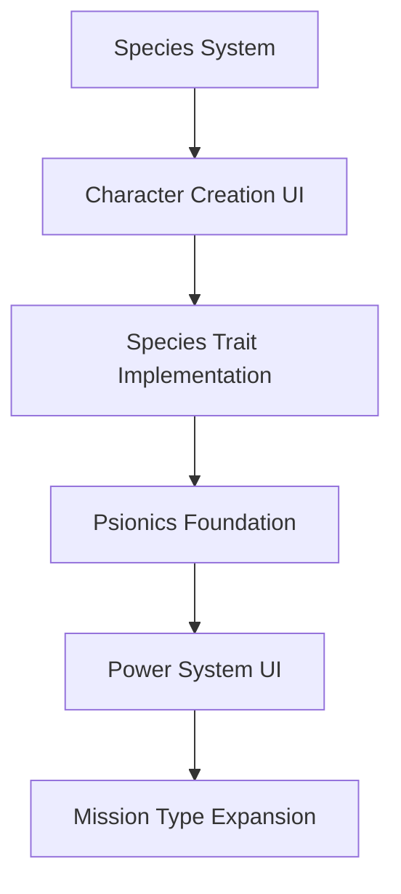

# Five Parsecs From Home - Compendium Expansion Analysis

## 📋 Executive Summary

This document provides a comprehensive breakdown of all expansion content from the **Five Parsecs From Home Compendium**, which consolidates features from three major expansion packs plus additional content. The analysis organizes features by source expansion, implementation complexity, and integration priority for our digital campaign manager.

**Source Expansions Included:**
- **Trailblazer's Toolkit** 
- **Freelancer's Handbook**
- **Fixer's Guidebook** 
- **Bug Hunt** (standalone military variant)
- **Universe Timeline** (9-page shared universe content)

---

## 🎯 CONTENT BREAKDOWN BY EXPANSION PACK

### **📦 TRAILBLAZER'S TOOLKIT**
*Focus: Character customization and expanded species options*

#### **🧬 New Species & Character Options**
| Feature | Implementation Complexity | Priority | Notes |
|---------|---------------------------|----------|-------|
| **Krag Species** | MEDIUM | HIGH | New stocky humanoid species with movement restrictions |
| **Skulkers Species** | MEDIUM | HIGH | Agile rodent-like humanoids with special abilities |
| **Updated Primary Alien Table** | LOW | HIGH | Modified species generation table |
| **Krag Colony Worlds** | MEDIUM | MEDIUM | Special world traits and visiting mechanics |
| **Skulker Colony Worlds** | MEDIUM | MEDIUM | Adventurous population trait system |

#### **🔮 Psionics System** 
| Feature | Implementation Complexity | Priority | Notes |
|---------|---------------------------|----------|-------|
| **Psionic Characters** | HIGH | HIGH | Complete new character type with restrictions |
| **10 Psionic Powers** | HIGH | HIGH | Powers table with range, targeting, effects |
| **Psionic Advancement** | MEDIUM | HIGH | XP spending for new powers and enhancements |
| **Psionic Legality System** | MEDIUM | HIGH | World-based legal status affecting gameplay |
| **Enemy Psionics** | HIGH | MEDIUM | AI-controlled psionic opponents |
| **Psi-Hunter Rivals** | MEDIUM | MEDIUM | Special rival type for illegal psionic usage |

#### **🛠️ Equipment Expansion**
| Feature | Implementation Complexity | Priority | Notes |
|---------|---------------------------|----------|-------|
| **New Training Courses** | LOW | MEDIUM | 5 new advanced training options |
| **Bot Upgrades** | MEDIUM | MEDIUM | 6 new bot enhancement options |
| **Ship Components** | MEDIUM | MEDIUM | 3 new ship parts with special effects |
| **Psionic Equipment** | LOW | MEDIUM | 3 psionic-specific items |

---

### **📦 FREELANCER'S HANDBOOK**
*Focus: Combat mechanics and mission variety*

#### **⚔️ Combat System Enhancements**
| Feature | Implementation Complexity | Priority | Notes |
|---------|---------------------------|----------|-------|
| **Progressive Difficulty** | MEDIUM | HIGH | Campaign turn-based scaling difficulty |
| **Difficulty Toggles** | LOW-MEDIUM | HIGH | 8 modular difficulty adjustment options |
| **AI Variations** | MEDIUM | MEDIUM | Randomized enemy behavior patterns |
| **Enemy Deployment Variables** | MEDIUM | MEDIUM | 9 tactical deployment modifications |
| **Escalating Battles** | MEDIUM | MEDIUM | Dynamic battle intensification system |
| **Elite-Level Enemies** | HIGH | MEDIUM | Complete upgraded enemy stat blocks |

#### **🎮 Multiplayer & Cooperation**
| Feature | Implementation Complexity | Priority | Notes |
|---------|---------------------------|----------|-------|
| **Player vs Player Battles** | HIGH | LOW | PvP initiative system and power ratings |
| **Expanded Co-op Battles** | HIGH | LOW | Two-crew cooperative missions |
| **Three-way Battles** | HIGH | LOW | PvP with neutral AI third party |

#### **🎲 Alternative Combat Systems**
| Feature | Implementation Complexity | Priority | Notes |
|---------|---------------------------|----------|-------|
| **No-Minis Combat Resolution** | MEDIUM | MEDIUM | Abstract combat system for campaigns |
| **Grid-Based Movement** | MEDIUM | LOW | Alternative movement mechanics |
| **Dramatic Combat** | LOW | MEDIUM | Cinematic weapon effects |
| **Terrain Generation** | MEDIUM | MEDIUM | Random battlefield creation tables |

---

### **📦 FIXER'S GUIDEBOOK**  
*Focus: Campaign depth and world-building*

#### **🌍 World & Campaign Systems**
| Feature | Implementation Complexity | Priority | Notes |
|---------|---------------------------|----------|-------|
| **Expanded Factions** | HIGH | HIGH | Complete faction relationship system |
| **Fringe World Strife** | MEDIUM | HIGH | Instability and chaos mechanics |
| **Loans: Who Do You Owe?** | MEDIUM | HIGH | Detailed debt and enforcement system |
| **Introductory Campaign** | MEDIUM | MEDIUM | Structured tutorial campaign |

#### **🎯 Mission Types Expansion**
| Feature | Implementation Complexity | Priority | Notes |
|---------|---------------------------|----------|-------|
| **Stealth Missions** | HIGH | HIGH | Infiltration-based scenarios |
| **Street Fights** | MEDIUM | HIGH | Urban combat encounters |
| **Salvage Jobs** | HIGH | HIGH | Exploration and salvage mechanics |
| **Expanded Missions** | MEDIUM | MEDIUM | Enhanced objective generation |
| **Expanded Quest Progression** | MEDIUM | MEDIUM | Advanced quest mechanics |
| **Expanded Connections** | LOW | MEDIUM | Enhanced opportunity missions |

#### **🏥 Advanced Systems**
| Feature | Implementation Complexity | Priority | Notes |
|---------|---------------------------|----------|-------|
| **Casualty Tables** | LOW | MEDIUM | Enhanced combat injury system |
| **Detailed Post-Battle Injuries** | MEDIUM | MEDIUM | Expanded injury resolution |
| **Name Generation Tables** | LOW | LOW | Random name generators |

---

### **📦 BUG HUNT** 
*Standalone military-themed variant with cross-compatibility*

#### **🎖️ Military Campaign Features**
| Feature | Implementation Complexity | Priority | Notes |
|---------|---------------------------|----------|-------|
| **Bug Hunt Core Rules** | HIGH | LOW | Complete standalone game system |
| **Character Transfer System** | MEDIUM | LOW | Moving characters between games |
| **Military Equipment** | MEDIUM | LOW | Specialized military gear |
| **Squad-Based Mechanics** | HIGH | LOW | Team-focused gameplay |

---

## 🏗️ IMPLEMENTATION ROADMAP

### **PHASE 1: HIGH PRIORITY CORE FEATURES** *(Estimated: 6-8 weeks)*

#### **Sprint 1: Species & Character Expansion** *(2 weeks)*
```gdscript
# New Species Implementation
class_name KragCharacter extends Character
class_name SkulkerCharacter extends Character

# Enhanced character creation
func create_character_with_species(species: CharacterSpecies) -> Character:
    var character = species.create_base_character()
    apply_species_traits(character, species)
    return character
```

#### **Sprint 2: Psionics System Foundation** *(2 weeks)*  
```gdscript
# Psionic power system
class_name PsionicPower extends Resource
class_name PsionicCharacter extends Character

# Power mechanics
func use_psionic_power(power: PsionicPower, target: Vector2) -> bool:
    var projection_roll = DiceSystem.roll_2d6()
    return resolve_psionic_effect(power, projection_roll, target)
```

#### **Sprint 3: Difficulty & Mission Systems** *(2 weeks)*
```gdscript
# Progressive difficulty
class_name DifficultyManager extends RefCounted
func apply_campaign_difficulty(turn_number: int) -> void

# Mission type expansion  
class_name StealthMission extends Mission
class_name StreetFightMission extends Mission
class_name SalvageMission extends Mission
```

### **PHASE 2: MEDIUM PRIORITY ENHANCEMENTS** *(Estimated: 4-6 weeks)*

#### **Combat System Overhauls**
- Elite Enemy Tables (complete stat block rewrites)
- AI Variations (behavioral randomization)
- Escalating Battles (dynamic encounter scaling)

#### **Faction & World Systems**  
- Expanded Factions (relationship tracking)
- Fringe World Strife (instability mechanics)
- Enhanced Loans System (debt enforcement)

### **PHASE 3: LOW PRIORITY FEATURES** *(Estimated: 3-4 weeks)*
- Player vs Player mechanics
- No-Minis Combat Resolution
- Bug Hunt integration
- Advanced terrain generation

---

## 🎯 SPECIFIC IMPLEMENTATION PRIORITIES

### **IMMEDIATE INTEGRATION TARGETS** *(Next 2 releases)*

#### **1. Species Expansion** 
```gdscript
# Krag special rules implementation
func apply_krag_traits(character: Character) -> void:
    character.can_dash = false  # No dash moves
    character.add_special_ability("belligerent_reroll")
    if character.has_patron():
        character.add_rival()  # Mandatory rival addition
```

#### **2. Difficulty Toggles**
```gdscript
# Modular difficulty system
class_name DifficultyToggle extends Resource
@export var name: String
@export var description: String  
@export var effects: Array[DifficultyEffect]

# Toggle implementations
func apply_strength_adjusted_enemies() -> void:
    enemy_count = crew_size + modifiers
```

#### **3. Enhanced Mission Types**
```gdscript
# Stealth mission mechanics
class_name StealthRound extends BattleRound:
    func resolve_stealth_actions() -> void:
        for character in active_characters:
            if character.is_detected():
                trigger_alert_mode()
```

### **ARCHITECTURAL CONSIDERATIONS**

#### **Database Schema Extensions**
```sql
-- Species expansion
ALTER TABLE characters ADD COLUMN species_type VARCHAR(20);
ALTER TABLE characters ADD COLUMN species_traits JSONB;

-- Psionics system
CREATE TABLE psionic_powers (
    id SERIAL PRIMARY KEY,
    character_id INTEGER REFERENCES characters(id),
    power_type VARCHAR(20),
    enhancement_level INTEGER DEFAULT 0
);

-- Faction relationships
CREATE TABLE faction_relationships (
    id SERIAL PRIMARY KEY,
    campaign_id INTEGER,
    faction_name VARCHAR(50),
    loyalty_level INTEGER,
    active_jobs JSONB
);
```

#### **Event System Integration**
```gdscript
# Signal-driven architecture for new features
signal psionic_power_used(character: Character, power: PsionicPower, result: bool)
signal faction_loyalty_changed(faction: String, old_level: int, new_level: int)
signal difficulty_toggle_activated(toggle: DifficultyToggle)

# Battle event system enhancement
signal stealth_compromised(mission: StealthMission, character: Character)
signal salvage_discovery(item: SalvageItem, location: Vector2)
```

---

## 🔧 TECHNICAL IMPLEMENTATION DETAILS

### **Psionics System Architecture**
```gdscript
# Core psionic mechanics
class_name PsionicSystem extends RefCounted

enum PsionicPower {
    BARRIER, GRAB, LIFT, SHROUD, ENRAGE,
    PREDICT, SHOCK, REJUVENATE, GUIDE, PSIONIC_SCARE
}

# Power resolution with dice integration
func resolve_psionic_projection(power: PsionicPower, range_needed: float) -> PsionicResult:
    var base_roll = DiceSystem.roll_2d6()
    var total_range = base_roll
    
    if total_range < range_needed:
        # Option to strain for additional range
        var strain_decision = await get_strain_decision()
        if strain_decision:
            var strain_roll = DiceSystem.roll_d6()
            total_range += strain_roll
            return resolve_strain_effects(strain_roll, power)
    
    return PsionicResult.new(true, total_range >= range_needed)
```

### **Elite Enemy System**
```gdscript
# Elite enemy composition
class_name EliteEnemyForce extends EnemyForce:
    func generate_composition(base_size: int) -> Array[Enemy]:
        var size = max(base_size, 4)  # Minimum 4 enemies
        var composition = []
        
        # Force structure based on size
        match size:
            4: composition = [3, 1, 0, 0]  # [basic, specialist, lieutenant, captain]
            5: composition = [2, 2, 1, 0]
            6: composition = [3, 2, 1, 0]
            _: composition = [3, 2, 1, 1]  # 7+ includes captain
        
        return build_enemy_force(composition)
```

### **Mission System Expansion**
```gdscript
# Enhanced mission generation
class_name ExpandedMissionGenerator extends MissionGenerator:
    func generate_mission() -> Mission:
        var overview = roll_objective_overview()  # Single, dual-required, dual-optional
        var objectives = generate_objectives(overview.count)
        var constraints = generate_time_constraints(objectives)
        var extraction = determine_extraction_method()
        
        return Mission.create(objectives, constraints, extraction)
    
# Stealth mission implementation
class_name StealthMission extends Mission:
    var stealth_round_active: bool = true
    var alert_level: int = 0
    
    func process_stealth_round() -> void:
        for character in player_characters:
            if character.is_visible_to_enemies():
                trigger_detection_check(character)
```

---

## 📊 FEATURE IMPACT ANALYSIS

### **High Impact Features** *(Transform core gameplay)*
1. **Psionics System** - Adds new character archetype and tactical options
2. **Species Expansion** - Provides meaningful character choice variety  
3. **Stealth Missions** - Introduces completely new gameplay paradigm
4. **Salvage Jobs** - Creates exploration-focused mission type
5. **Progressive Difficulty** - Addresses campaign balance over time

### **Medium Impact Features** *(Enhance existing systems)*
1. **Difficulty Toggles** - Customizable challenge levels
2. **Expanded Factions** - Deeper political relationships
3. **Elite Enemies** - Enhanced combat challenge
4. **Street Fights** - Urban combat scenarios
5. **AI Variations** - Unpredictable enemy behavior

### **Low Impact Features** *(Quality of life improvements)*
1. **Name Generation** - Convenience feature
2. **Terrain Generation** - Automated battlefield setup
3. **No-Minis Combat** - Alternative resolution method
4. **PvP Mechanics** - Multiplayer option
5. **Bug Hunt Integration** - Cross-game compatibility

---

## 🚀 INTEGRATION STRATEGY

### **Phase 1 Implementation Plan**


### **Data Migration Requirements**
- Extend Character model for species and psionic data
- Add Mission type variants to campaign system
- Create Faction relationship tracking
- Implement Difficulty setting persistence

### **Testing Strategy**
- Unit tests for all new mechanical systems
- Integration tests for mission generation
- Psionics power interaction testing
- Species trait validation testing
- Elite enemy balance verification

---

## 📈 SUCCESS METRICS

### **Implementation Success Criteria**
- [ ] All 3 new species fully implemented with special rules
- [ ] Complete 10-power psionics system with UI
- [ ] 3 new mission types (Stealth, Street Fight, Salvage) functional
- [ ] Progressive difficulty system affecting enemy encounters
- [ ] Elite enemy tables with enhanced combat challenge

### **Player Experience Goals**
- **Character Variety**: 40% increase in viable character build options
- **Mission Diversity**: 60% increase in mission type variety  
- **Campaign Depth**: 2x longer campaigns with sustained interest
- **Tactical Complexity**: New strategic considerations in combat
- **Customization Options**: Granular difficulty and playstyle control

---

## 🔮 FUTURE EXPANSION OPPORTUNITIES

### **Post-Implementation Enhancements**
1. **Procedural Faction Politics** - Dynamic faction relationship evolution
2. **Advanced Psionics** - Psionic artifacts and enhanced powers  
3. **Ship-to-Ship Combat** - Space battle mechanics from Bug Hunt
4. **Sector-Wide Campaigns** - Multi-world interconnected stories
5. **Modding Framework** - Community content creation tools

### **Cross-System Integration**
- Bug Hunt character transfer mechanics
- Shared universe timeline integration
- Cross-expansion equipment compatibility
- Unified progression systems

---

*This analysis provides the foundation for implementing the complete Five Parsecs From Home expanded universe in our digital campaign manager, prioritized by impact and feasibility for maximum player value.*